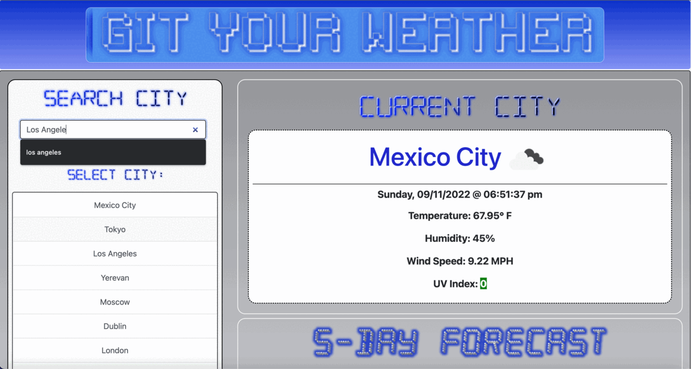
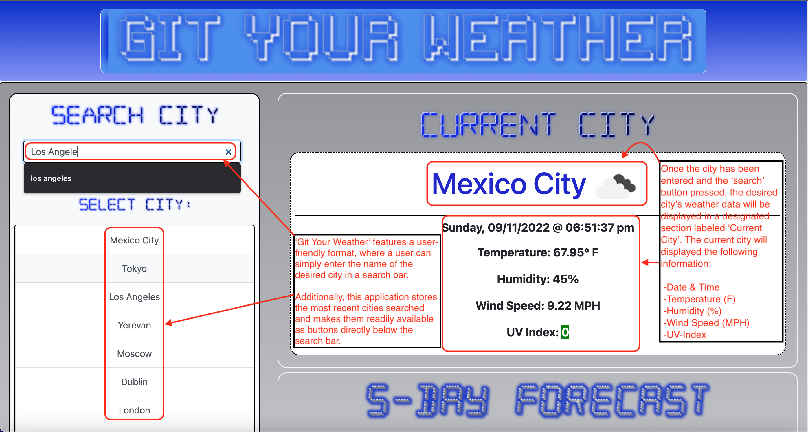
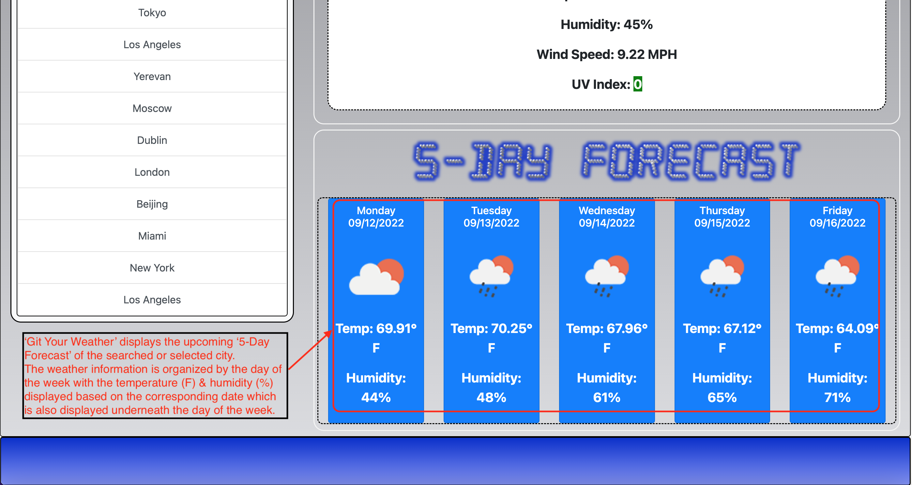
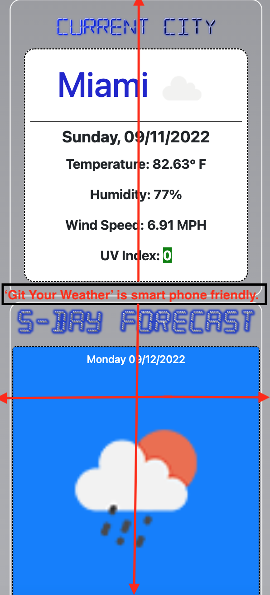
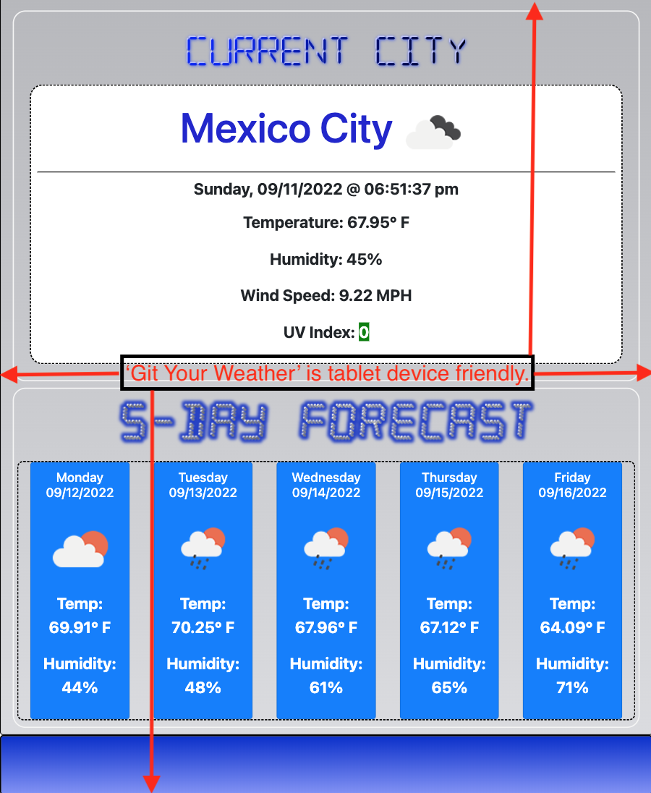

# Git Your Weather

## APPLICATION OVERVIEW:

Live weather data is essentially available all throughout the web, however time needs to be invested in searching for the weather info that best fits every individual. The Git Your Weather application has been developed to eliminate the time needed to search the web for best fitting weather information specified by a user.

Git Your Weather is a web-based application that utilizes, third-party APIs allowing access to their data and functionality by making requests with specific parameters to a URL. This application will retrieve data from other application's APIs and stage it based on live weather data parameters set by a user. 

Git Your Weather is essentially a weather dashboard that will run in the browser featuring dynamically updated HTML, CSS, and JavaScript languages. Lastly, 'localStorage' will be utilized to store any persistently used data for additional user convenience.

- - -

## USER STORY:

```
AS A traveler
I WANT to see the weather outlook for multiple cities
SO THAT I can plan a trip accordingly
```

- - -

## ACCEPTANCE CRITERIA:

Below is an acceptance criteria outlining the functionality requirement expectations the application needs to satisfy:

```
GIVEN a weather dashboard with form inputs
WHEN I search for a city
THEN I am presented with current and future conditions for that city and that city is added to the search history
WHEN I view current weather conditions for that city
THEN I am presented with the city name, the date, an icon representation of weather conditions, the temperature, the humidity, the wind speed, and the UV index
WHEN I view the UV index
THEN I am presented with a color that indicates whether the conditions are favorable, moderate, or severe
WHEN I view future weather conditions for that city
THEN I am presented with a 5-day forecast that displays the date, an icon representation of weather conditions, the temperature, the wind speed, and the humidity
WHEN I click on a city in the search history
THEN I am again presented with current and future conditions for that city
```

- - -

## MOCK-UP:

> **Note**: The GIF & images below represent the look and functionality of the Git Your Weather application:





### Main Screen:




### Functionality:




### Smart-Phone Compatibility:




### Tablet Device Compatibility:




> **Note:** The deployed webpage and GitHUB repository URLs are located below:

### Deployed Webpage URL:
https://aasports89.github.io/Git-Your-Weather/

### GitHUB Repository URL:
https://github.com/AASports89/Git-Your-Weather

- - -

## EVALUATION GUIDELINES:

> **Note**: Below are specified guidelines used to evaluate the application for quality assurance and ensure 'Minimal Viable Product' standards have been met:

### Technical Acceptance Criteria: 40%

* Satisfies all of the above acceptance criteria plus the following:

    * Uses the OpenWeather API to retrieve weather data.

    * Uses `localStorage` to store persistent data.

### Deployment: 32%

* Application deployed at live URL.

* Application loads with no errors.

* Application GitHub URL submitted.

* GitHub repository that contains application code.

### Application Quality: 15%

* Application user experience is intuitive and easy to navigate.

* Application user interface style is clean and polished.

* Application resembles the mock-up functionality provided in the Challenge instructions.

### Repository Quality: 13%

* Repository has a unique name.

* Repository follows best practices for file structure and naming conventions.

* Repository follows best practices for class/id naming conventions, indentation, quality comments, etc.

* Repository contains multiple descriptive commit messages.

* Repository contains quality readme file with description, screenshot, and link to deployed application.


- - -
- - -